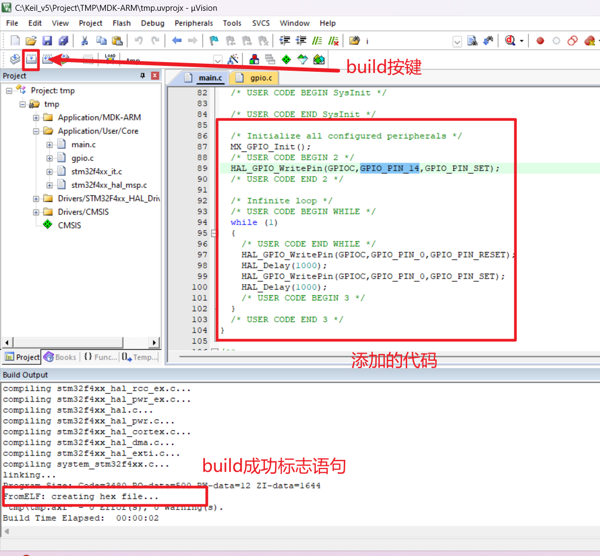

# Keil创建STM32项目并烧录使用

## 1、软件准备

- 创建软件：[STM32CubeIDE](https://www.st.com.cn/zh/development-tools/stm32cubeide.html#get-software)
  和 [STM32CubeMX](https://www.st.com/content/st_com/en/stm32cubemx.html#)
    - 选择合适的型号直接下载最新版即可
- 编译软件：[Keil](https://www.keil.com/download/product/)
    - 一定要选择 `MDK-Arm` 下载
- 烧录软件：[J-Link](https://www.segger.com/downloads/jlink/)
    - 选择合适的型号直接下载即可

## 2、操作步骤

### 2.1、软件下载安装

> 为以防万一加的，原则上来讲，顺着官网流程走，不太可能会出错

#### 2.1.1、[STM32CubeIDE](https://www.st.com.cn/zh/development-tools/stm32cubeide.html#get-software) 和 [STM32CubeMX](https://www.st.com/content/st_com/en/stm32cubemx.html#) 下载安装

> 以前者为例，后者一个流程，就是界面有些区别

- 点击标题（那是个超链接，会直接跳转到网站），下翻会出现如下界面
  
- 根据电脑操作系统（Windows、Linux……）选择后，点击 `下载最新版本`
  
- 下翻接受即可自动下载（如果没有登录，会弹出注册/登录界面，注册登录即可）
- 下载后是一个压缩包（前者 1G 大小，后者 500M），解压后里面是安装包，打开后一直同意就好

#### 2.1.2、[Keil](https://www.keil.com/download/product/) 下载安装

- 点击标题（那是个超链接，会直接跳转到网站），会出现如下界面
  
- 点击 `MDK-Arm`，弹出的界面内容随意填写，下翻点击 `Submit`
  
- 点击 `XXX.EXE` 即可下载安装包
  
- 双击下载好的安装包打开，一直选 `next` 和同意直到下面这个页面
  
- 上面的两个路径一定要选择在一个自己可以找到的地方（默认的路径是一个隐藏文件夹），因为一旦电脑里还有 Keil 的 C51
  版本，有可能二者之一会找不到，然后无法打开对应项目。不过，无论是 C51 还是 MDK，安装后的软件本体都是在各自 UV4 文件夹下面的那个叫
  UV4 的 EXE 文件
  
- 之后依旧是一直选 `next` 和同意，出现需要填写的地方会有提示，随便填即可
- 下载 [注册机](https://blog.csdn.net/wy1948/article/details/113530260)，打开注册机和软件，按下面的顺序行动
  

#### 2.1.3、[J-Link](https://www.segger.com/downloads/jlink/) 下载安装

- 点击标题（那是个超链接，会直接跳转到网站），会出现如下界面
  
- 下翻选择合适的版本点击，弹出弹窗，点击 `DownLoad`
  
- 进入新界面，下翻点击 `I accept these Terms of Use`，点击 `Download`
  
- 打开安装包后一直选 `next` 和同意即可
- 之后将开发板和 J-Link 和电脑连接起来即可在设备管理器看到
  

### 2.2、项目创建

- 打开安装好的 STM32CubeIDE，点击屏幕左侧的 `Start new STM32 project`（首次使用会自动下载需要的东西）
  
- 或如果已经进入项目了，就从这里创建
  
- 选择开发板为所需开发板（我们使用的是 `STM32F446RCT6`）
  
- 创建项目，记得选择合适的路径
  
- 加载过程中会弹出一个弹窗（手太快了，没截到），选择 `Yes`，会自动打开 `.ioc` 文件，方便接下来配置
- 进行一些配置，并保存（叉掉会自动弹出是否保存）
  
- 打开 STM32CubeMX，选择刚才建立的项目的 `.ioc` 文件并配置
  
- 这时打开自己的项目文件夹，将发现多出来一个 `MDK-ARM` 的文件夹，里面存放着 Keil 项目文件
  

### 2.3、KEIL 配置环境

- 使用 Keil 打开刚才的项目文件，注意：一定要用安装 Keil 时为 `Core` 选择的路径下的名为 `UV4` 的文件夹下的那个 Keil 打开
  
- 打开后进行配置（点击魔法棒，在弹窗的对应界面进行选择，图中只是为了方便才把俩弹窗放一个图中，实际上还是同一个弹窗的不同界面）
  
- 电脑连接 J-Link 并继续配置（还是点击魔法棒进行配置）
  
- 上面的两步完成后记得点击 `OK` 保存
  
- `Build` 测试（测试代码在下面）
  
  
- `Build` 要是不好使，就点一下 `ReBuild`
  
- 烧录测试，下面的图依次是：开发板连线图、烧录正常情况图（keil 显示）
  
  
- 烧录成功，结果如下图，左侧小灯常亮，右侧小灯以 2s 为周期闪烁
  

```C
// 测试代码 - 具体位置结合图片
// 以下代码写在 main.c 的 main 函数的 while 外
HAL_GPIO_WritePin(GPIOC,GPIO_PIN_14,GPIO_PIN_SET);
// 以下代码写在 main.c 的 main 函数的 while 里
HAL_GPIO_WritePin(GPIOC,GPIO_PIN_0,GPIO_PIN_RESET);
HAL_Delay(1000);
HAL_GPIO_WritePin(GPIOC,GPIO_PIN_0,GPIO_PIN_SET);
HAL_Delay(1000);
/******************************************************************/
// 以下代码补在 gpio.c 的 MX_GPIO_Init 函数已有内容之后
GPIO_InitTypeDef GPIO_InitStruct = {0};

/*Configure GPIO pin Output Level */
HAL_GPIO_WritePin(GPIOC, GPIO_PIN_14 | GPIO_PIN_0, GPIO_PIN_RESET);

/*Configure GPIO pin : PtPin */
GPIO_InitStruct.Pin = GPIO_PIN_14 | GPIO_PIN_0;
GPIO_InitStruct.Mode = GPIO_MODE_OUTPUT_PP;
GPIO_InitStruct.Pull = GPIO_NOPULL;
GPIO_InitStruct.Speed = GPIO_SPEED_FREQ_LOW;
HAL_GPIO_Init(GPIOC, &GPIO_InitStruct);
```

### 2.4、烧录

## 3、备注